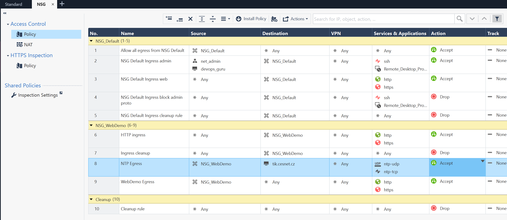
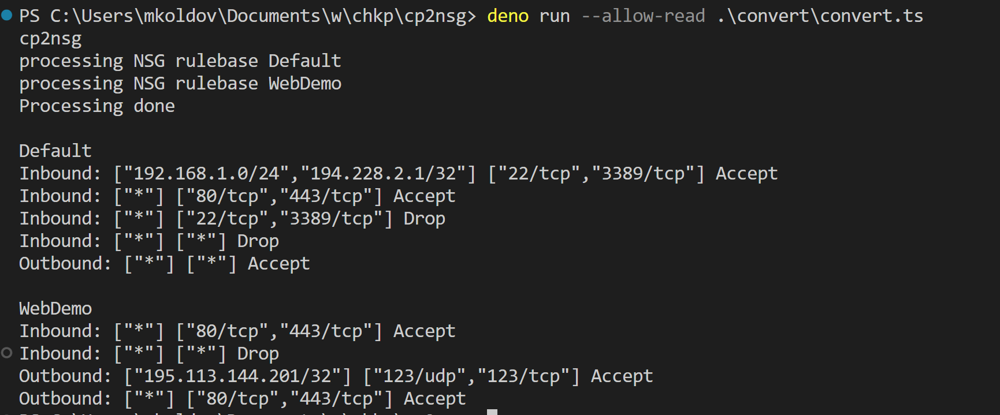

# Manage Azure NSGs with Check Point SmartConsole



Sample result 



Usage:
```powershell

# get Deno
winget install -e DenoLand.Deno

# create S1C creds .env file - see below
code .env

# fetch policy and save as Terraform code
# preview result frst
deno run --allow-net --allow-read ./convert/convert.ts --s1c 
# bash
deno run --allow-net --allow-read ./convert/convert.ts --s1c | tee ./tf-nsgs/generated-nsgs.tf
# pwsh
deno run --allow-net --allow-read ./convert/convert.ts --s1c | Set-Content .\tf-nsgs\generated-nsgs.tf

# review result
code .\tf-nsgs\generated-nsgs.tf

# use Terraform to deploy
cd .\tf-nsgs\
terraform init
terraform apply 
```

Smart-1 Cloud setup in .env
```
CPSERVER="yourown-za8upq50.maas.checkpoint.com"
CPTENANT="ccae851f-tttt-4fcf-a0da-c50788f1dde3"
CPAPIKEY="useyourownkey"
```